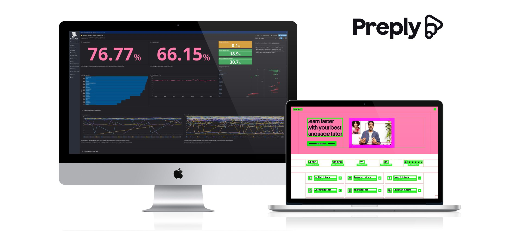

# Preply Design System Visual Coverage



> [!NOTE]
> As promised during the recent talks: with the April/May 2025 update, the core and Web libraries are now Preply-agnostic, and we rewrote the docs and tutorials accordingly.

This repository contains the implementation of Preply's design system Visual Coverage (React and React Native), that's how Preply **measure the impact of the Design System from the users' perspective**. If you haven't done it before, please read the [Visual coverage: Why and How Preply Measures the Impact of the Design System](https://medium.com/preply-engineering/visual-coverage-why-and-how-preply-measures-the-impact-of-the-design-system-1057115f4aff) article about the topic to know the why's behind it, and [The Implementation Details of Preply’s Design System Visual Coverage](https://medium.com/preply-engineering/the-implementation-details-of-preplys-design-system-visual-coverage-86b4a78ad2bb) to dig into the implementation details and performance optimizations.

> _You may have heard of the project:_
>
> - _At the [Into Design Systems conference](https://www.intodesignsystems.com/): here you can find [the article they wrote about it](https://intodesignsystems.substack.com/p/measuring-design-system-impact-lessons), and [the resources we shared](https://www.figma.com/community/file/1509535015145685735/design-system-visual-coverage-resources))._
> - _At the [JSDay](https://www.jsday.it/) conference: here is [the talk description](<https://www.jsday.it/talks_speakers/#DesignSystemVisualCoverageInWebAndApp(ReactNative)Applications>), the [recording](https://www.youtube.com/watch?v=xy3mRyXDMHo), and the [slides](https://cef62.github.io/design-system-coverage-jsday-2025)._
> - _At one of [Belka](https://www.belkadigital.com/)’s AMA: here is [the recording](https://www.youtube.com/watch?v=Kw_eGDppG4M) (in Italian)._
> - _At one of the [Commit to Growth](https://podcasts.apple.com/it/podcast/commit-to-growth/id1788326535)’s episodes: here is [the recording](https://podcasts.apple.com/us/podcast/lessons-from-large-codebases-design-visual-coverage/id1788326535?i=1000688799413). The podcast is curated by one of Preply’s engineers: [Yasemin çidem](https://medium.com/u/754df0a2b156?source=post_page---user_mention--1057115f4aff---------------------------------------)._

## Why are we sharing it?

Measuring the impact of a design system is something all the companies that have one struggle with. By sharing the visual coverage's implementation our implementation, we aim to to provide a quick way to test our solution on other companies' context, then collecting feedback and improving it.

This monorepo comes from Preply's design system, and we removed everything apart fro the visual coverage code.

## I want to try it out, what should I do?

Follow the instructions shared in the [`@preply/ds-visual-coverage-web`'s README](./packages/visual-coverage-web/README.md).

Please note: only some relevant functions are tested, but the code has been battle tested on Preply.com since we calculate the visual coverage there thousands of times a day.

## I like and I want to scale it as Preply did, what should I do?

In the `production-code/web` directory, you can look at all the functions we use to enable the visual coverage in prod and how we send data to our Data Warehouse which, in turn, sends the visual coverage events to DataDog. We are sharing it just to show how we use it, we don't expect you to copy/paste it in your website.

The code we run in our web app is the following

```js
if (isDsVisualCoverageSupported() === 'yes') {
  initDsVisualCoverageInProd({
    userType,
    log: false,
    checkInterval: 500,
  }).start();
}
```

### DataDog dashboard

If you also use DataDog, look at [datadog-dashboard.json](./production-code/datadog-dashboard.json) to create the same dashboard of ours in seconds. Please note it's the dashboard we have at the moment of writing, we will improve it since it's not 100% done but maybe we will not keep the JSON file aligned.

[datadog-monitoring-dashboard.json](./production-code/datadog-monitoring-dashboard.json) is useful to track and check errors and warnings.

## React Native

At the moment of writing, the React Native implementation is not as portable as the Web one. We suggest you to get in touch with us if you want to use it on React Native.

<!-- 1. `useDsComponentTestId` that tweaks the React Native's components `testID` to recognize them when parsing the whole views hierarchy.
2. `useCoverageContainerTestId` that tweaks the React Native's components `testID` to recognize visual coverage containers.
3. `CoverageSetupProvider` to enable the just-mentioned hooks.
4. [ToolkitManager.swift](./production-code/app/ToolkitManager.swift) that contains the code to retrieve all the views' data.
5. [test-utils.tsx](./production-code/app/test-utils.tsx) which contains our custom [Detox's by.id](https://github.com/wix/Detox) function we use in the E2E tests. -->

## Get in touch

We'd like to head your feedback, you can contact us at design-system@preply.com, or directly with me on [X](https://x.com/NoriSte), [GitHub](https://github.com/NoriSte), or [LinkedIn](https://www.linkedin.com/in/noriste/).
